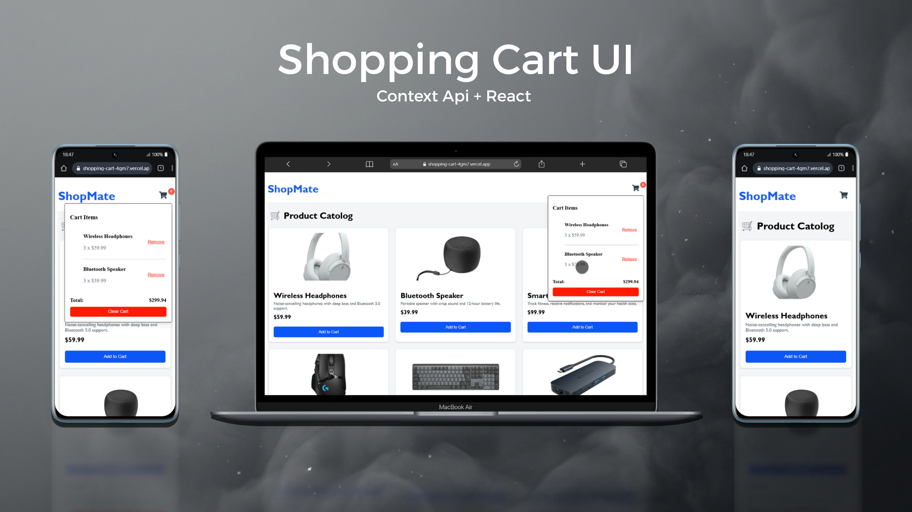

# Shopping Cart UI

This project is an e-commerce application developed in React, focusing on the use of the Context API for global state management. The application simulates an online store where it is possible to view products, add them to the cart, and manage the selected items.



# Technologies Used

- React Js
- Context Api
- Mock API
- Proxy
- Git & GitHub

# Context Api Implementation 

In this project, I used React's Context API to manage the application's global state in an organized and scalable way, avoiding prop drilling and facilitating data sharing between components.

The application was structured with two main contexts:

- ProductContext -> Responsible for the products (API data).

- CartContext -> Responsible for the logic and status of the shopping cart.

In main.jsx, both providers wrap the application:

```jsx

<ProductProvider>
  <CartProvider>
    <App />
  </CartProvider>
</ProductProvider>

```


This ensures that any component within the ```<app />``` has access to product and cart data.

## 🛍️ Product Context

The ProductContext is responsible for retrieving product API data as soon as the application loads, using useEffect and fetch. It manages three main states: the product list (products), the loading status (loading), and possible errors (error). This way, any application component can access the products and the request status in a simple and standardized way, just by consuming the context.

```jsx

import { createContext, useState, useEffect } from "react";

export const ProductContext = createContext();
export function ProductProvider({children}){
    const [products, setProducts] = useState([]);
  const [loading, setLoading] = useState(true);
  const [error, setError] = useState(null);

  useEffect(() => { 
    const fetchProducts = async () => {
      try {
        const res = await fetch('https://697405a7b5f46f8b5828ba3f.mockapi.io/api/v1/products');
        if (!res.ok) throw new Error('Failed to fetch products');
        const data = await res.json();
        console.log(data);
        setProducts(data)
      } catch (err) {
        setError(err.message);
      } finally{
        setLoading(false);
      }
    }

    fetchProducts();


   }, [])

   return(
    <ProductContext.Provider value={{products, loading, error}}>
        {children}
    </ProductContext.Provider>
   )
}

```

## Cart Context

The CartContext handles all the logic of the shopping cart. It stores the added items, controls the quantity of each product, and provides functions to add (addToCart), remove (removeFromCart), and clear the cart (clearCart). Furthermore, the cart state is persisted in localStorage, ensuring that data is not lost when refreshing the page.

```jsx

import { useState, useEffect, createContext } from "react";


export const CartContext = createContext();
export function CartProvider({children}){
    const [cart, setCart] = useState(() => {
        const stored = localStorage.getItem('cart')
        return stored ? JSON.parse(stored) : []
    })


    {/*Local storage*/}

    useEffect(() => { 
        localStorage.setItem('cart', JSON.stringify(cart))
     }, [cart])


    {/*Logica para adcionar no carrinho*/}
    const addToCart = (product) => {
        setCart((prev) => {
            const existing = prev.find((item) => item.id === product.id);

            if (existing) {
                return prev.map((item) => item.id === product.id ? { ...item, qty: item.qty + 1} : item)
            }

            return [...prev, {...product, qty: 1}]
        })
    }


     const removeFromCart = (id) => {
        setCart((prev) => prev.filter((item) => item.id !== id))
     }

     const clearCart = () => setCart([])
 

    return(
        <CartContext.Provider value={{cart, addToCart, removeFromCart,clearCart}}>
            {children}
        </CartContext.Provider>
    )
}


```

# Completeness

- Display Product Data
- Cart Items Dropdown
- Remove Items and Clear Cart
- Store Cart Items to Local Storage


